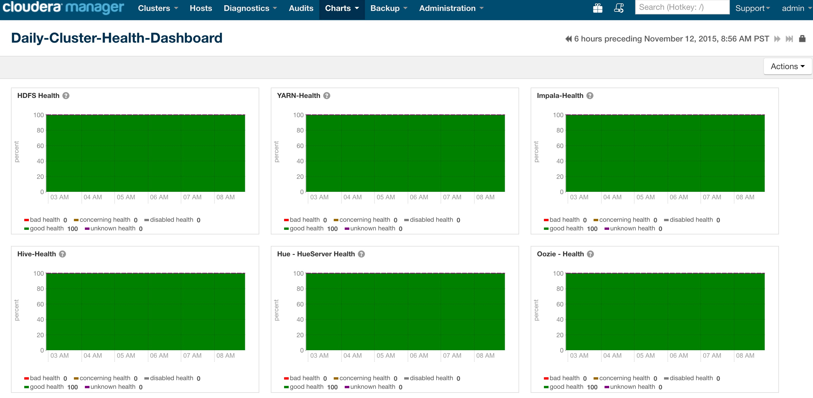
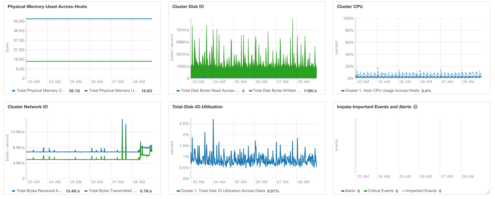
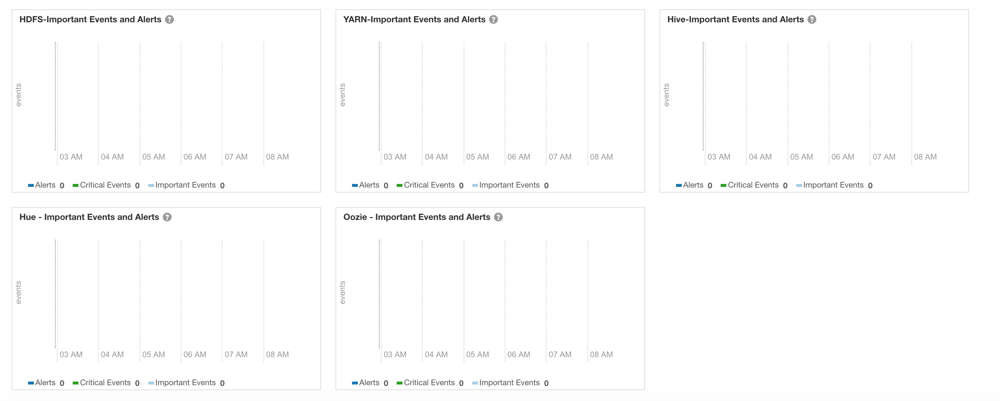
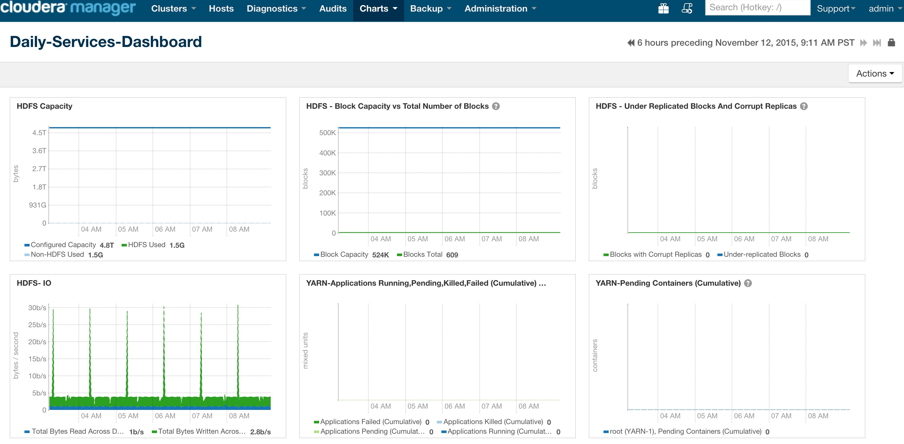
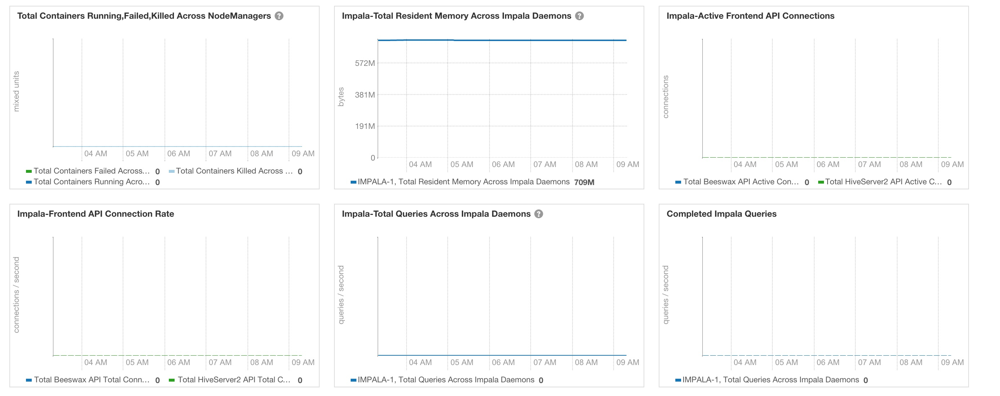
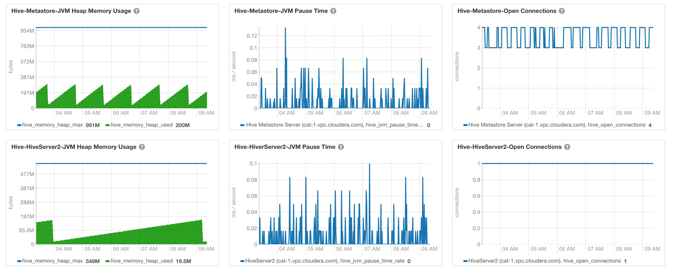
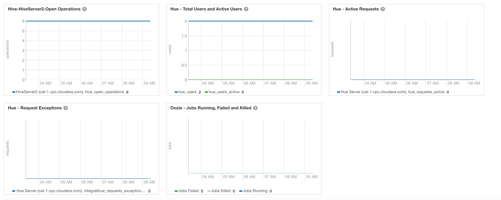

# cm-daily-dashboards

## Cloudera Manager Dashboards for Hadoop Administrators

This repository is a collection of dashboards and charts Cloudera customers use
as part of their daily tasks to answer the famous question 'How is my cluster
doing today?'

To learn more about how to build charts and dashboards, please visit the
following link [Cloudera Manager Charting Time-Series data](http://www.cloudera.com/content/www/en-us/documentation/enterprise/latest/topics/cm_dg_chart_time_series_data.html "Charts and Dashboards").

To learn more about how to interpret the charts and various metrics in the
charts, please visit [Cloudera Manager Metrics](http://www.cloudera.com/content/www/en-us/documentation/enterprise/latest/topics/cm_metrics.html "Cloudera Manager Metrics").

Based on our experience at several of our large customers, most popular charts
are placed into the following main dashboards.

1. Daily-Cluster-Health-Dashboard
2. Daily-Services-Dashboard

### Daily-Cluster-Health-Dashboard

Dashboard consists of the following charts.

tsqueries for the below charts are [here](daily-cluster-health-dashboard.md).

### Daily-Services-Dashboard

Dashboard consists of the following charts.

tsqueries for the below charts are [here](daily-services-dashboard.md).

### Additional Notes

[tsquery Language ](http://www.cloudera.com/content/www/en-us/documentation/enterprise/latest/topics/cm_dg_tsquery.html)
is very powerful and super useful in querying the Time-Series data in
Cloudera Manager.

Charts displayed in the above dashboards are just a few of 100's of charts that
 Cloudera Manager provides out of the box. Different customers use Hadoop
 clusters differently and we encourage you to modify the dashboards we present
 here based on your needs (example, may be you only need HBase and Solr).

Even better we encourage you to identify the most common issues that you see on
your cluster and create dashboards to monitor metrics that can help you
proactively monitor to prevent these common issues.

TL;DR - Add your personal touch to these dashboards
